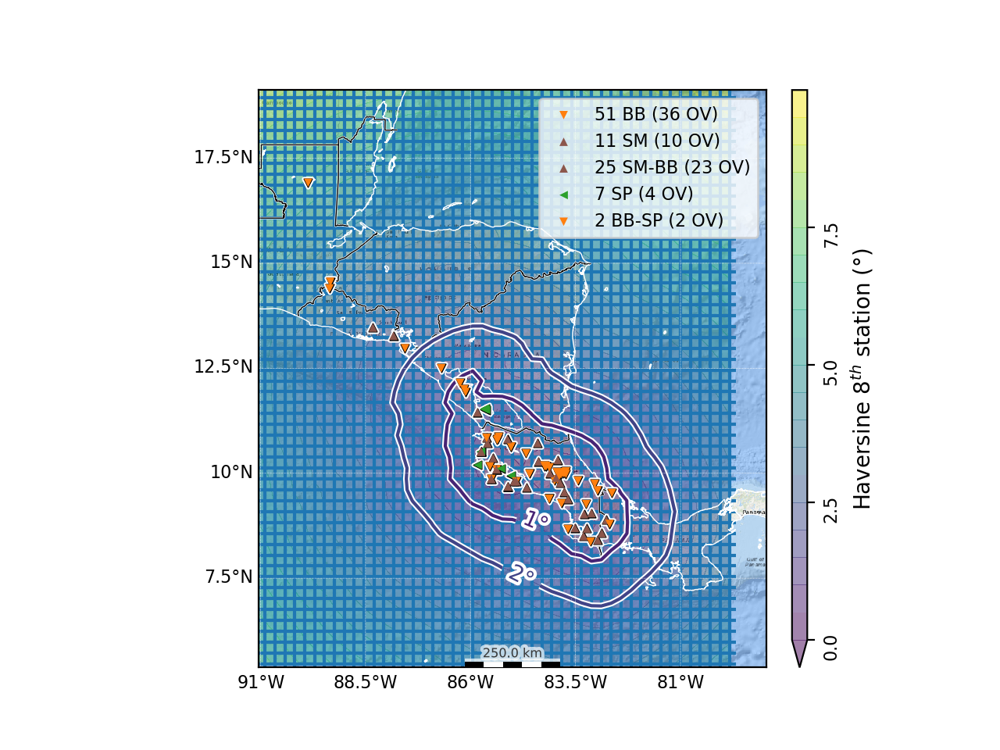

# SeisComP Location Grid Tuning

## What?
The `scautoloc` module of SeisComP requires a grid file specifying the minimum number of station and within a given distance radius of each specified point where to start locating an event.
This grid file allows precise tuning of the possible event origins, and false alarm reduction, by specifying a conservative distance computed for each grid point, considering a given minimum number of station.
See https://docs.gempa.de/seiscomp3/current/apps/scautoloc.html#grid-file

`./grid4autoloc` considers every station with a pick in the last 9 days as active stations (a logic to be refined in future), and compute the distance to twice the number of required stations as the radius from each grid point.
A custom query is used to find active stations, the `scquery` module should be configured with at least basic database access.
The station locations are taken via the `fdsnws` SeisComP module which should be running.
The default number of required stations is 4 (i.e. distances thresholds are computed for 8 stations with default safety ratio of 2).
However, when the distance is over 3 degrees, the code switches to a so-called teleseismic case where the minimal station number is 9.
The default safety ratio of 2 or default number of required stations in normal or teleseismic case (and other things) might be modified in the code if required.

## How?
This code required `curl`, `python` and `numpy` to be installed in your system.

Command arguments:
- The first mandatory argument is the author of picks to use for active station search, e.g. `scautopick@$HOSTNAME`.
- The second mandatory argument is the original grid file to be used for tuning, e.g. `$SEISCOMP_ROOT/share/scautoloc/grid.conf`.

Assuming default configuration, basic usage might be:
```
./grid4autoloc scautopick@$HOSTNAME $SEISCOMP_ROOT/share/scautoloc/grid.conf
```

The result might be written to `$SEISCOMP_ROOT/etc/grid-autotune.conf`.
Setup the following in `.seiscomp3/scautoloc.cfg` to use the new grid:
```
autoloc.grid = @SYSTEMCONFIGDIR@/grid-autotune.conf
```

To  have the  grid plotted on scolv GUI do:
```bash
MYGRID=${SEISCOMP_ROOT}/share/scautoloc/grid.conf
awk '{print $3}'  ${MYGRID}|sort -u|while read D; do mkdir -p ~/.seiscomp3/bna/grid/${D} ; awk '$3~/'$D'/{NL=NL+1;{if($2>180) $2=$2-360} printf "\"%d\",\"grid point %d %.1f km deep\", 1\n",NL,NL,'$D' ;printf "%s,%s\n",$2,$1}'  ${MYGRID}/share/scautoloc/grid.conf >  ~/.seiscomp3/bna/grid/${D}/grid.bna;done
```

## Next?
Next features, still missing, yet to be developed:
1. Safer output only if all `scquery`, `curl`, and `fdsnws` requests are successful, return an error before writing outputs otherwise (will require one more optional command argument).
2. Customise queries for database suffix.
3. You name it.
